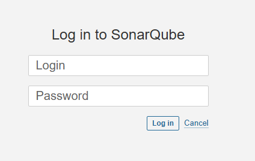
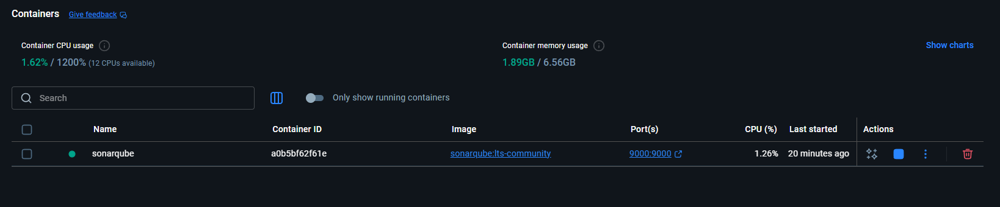
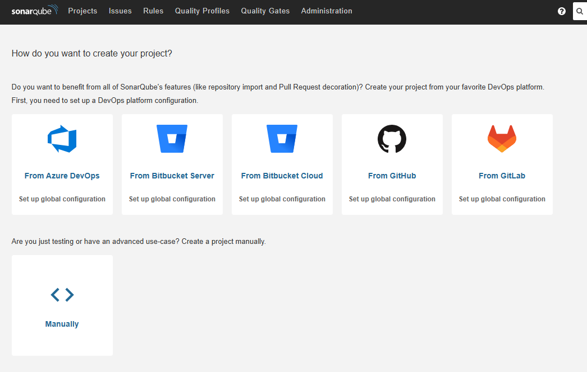
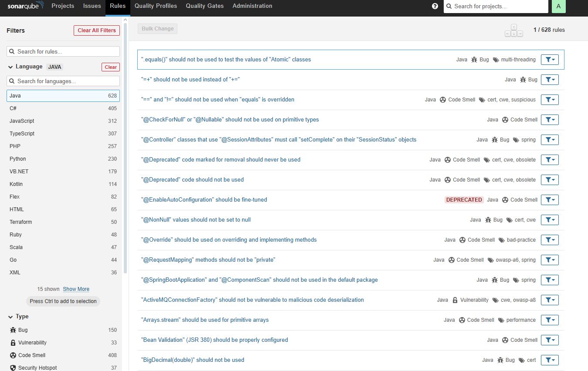

# 🚀 SonarQube con Docker

Guía paso a paso para instalar y ejecutar **SonarQube** usando **Docker**.  

---

## 📦 Requisitos previos
- Tener instalado **Docker Desktop (Community Edition)**.  
- Activar **Hyper-V** o la máquina virtual en tu sistema (según SO).  
- Tener una cuenta en [Docker Hub](https://hub.docker.com/) e iniciar sesión.  

---

## 🐳 1. Obtener la imagen oficial
Abre una terminal en Docker Desktop y ejecuta:
docker pull sonarqube:community
🔹 Para la versión Long Term Support (LTS):
```
docker pull sonarqube:lts-community
```
## 🛠 2. (Opcional) Crear una imagen personalizada
Si necesitas añadir plugins preinstalados u otras configuraciones:

## Clonar repositorio de Bitnami
git clone https://github.com/bitnami/containers.git

## Entrar al directorio de SonarQube
```
cd bitnami/sonarqube/VERSION/OPERATING-SYSTEM
```
## Construir la imagen personalizada
```
docker build -t mi-sonarqube:latest .
```
## ▶️ 3. Ejecutar SonarQube
Con la imagen lista (oficial o personalizada), levanta un contenedor:
```
docker run -d --name sonarqube -p 9000:9000 sonarqube:lts-community
```
## 🔍 Explicación rápida
```
-d → ejecuta en segundo plano (detached mode).

--name sonarqube → nombre del contenedor.

-p 9000:9000 → expone el puerto 9000.
```
## 🌐 4. Acceder a SonarQube
Abre tu navegador en:

👉 http://localhost:9000

Desde aquí podrás usar la interfaz gráfica y configurar tu instancia.

📋 Cheat Sheet (Resumen rápido)
## Descargar imagen
```
docker pull sonarqube:lts-community
```
## Ejecutar contenedor
```
docker run -d --name sonarqube -p 9000:9000 sonarqube:lts-community
```
## Acceder en navegador
http://localhost:9000

* Por defecto el user y pass es admin:admin; Debes modificarlo a un mejor pass. La seccion mas importante sera la pestaña de Rules que estaremos utilizando.






# Flujo CI/CD con Jenkins

Este repositorio describe un flujo típico de **Integración Continua (CI)** y **Despliegue Continuo (CD)** utilizando **Jenkins** como herramienta de orquestación.  

El objetivo es automatizar desde la compilación del código hasta el despliegue y monitoreo, reduciendo errores manuales y acelerando la entrega de software.  

---

## 📊 Diagrama del flujo CI/CD


flowchart LR
    A[📦 Código Fuente] --> B[🤖 CI - Integración Continua<br/>(Build, Tests, Herramientas de Automatización)]
    B --> C[🚀 CD - Despliegue Continuo<br/>(Deploy en entornos)]
    C --> D[⚙️ Gestión Post-Despliegue<br/>(Monitoreo, Mantenimiento, Feedback)]

    %% Jenkins en todo el proceso
    B -.-> E[Jenkins - Orquestador CI/CD]
    C -.-> E

## ⚙️ Explicación de cada etapa del flujo CI/CD

Este flujo asegura calidad, automatización y entregas rápidas mediante un proceso controlado y escalable.

---

## 📂 Código Fuente (Source Code)
- 📦 El repositorio contiene el **código de la aplicación**.  
- 🔄 Uso de **control de versiones** con GitHub, GitLab o Bitbucket.  

---

## 🔄 Integración Continua (CI)
- 🏗 **Compilación del código**.  
- ✅ Ejecución de **tests automatizados** (unitarios, integración, funcionales).  
- 🔍 **Análisis estático de calidad** con herramientas como **SonarQube**.  
- 📑 **Generación de reportes** para validar el estado del proyecto.  

---

## 🚀 Despliegue Continuo (CD)
- 🔄 **Despliegue automático** a entornos de **testing**, **staging** o **producción**.  
- 🐳 Uso de **contenedores (Docker/Kubernetes)** para asegurar portabilidad y escalabilidad.  

---

## 📡 Gestión Post-Despliegue
- 📊 **Monitoreo de la aplicación** en tiempo real.  
- 📜 **Logs centralizados** para depuración eficiente.  
- 🚨 **Alertas de rendimiento y errores** configuradas automáticamente.  
- 🔁 **Retroalimentación** al equipo de desarrollo para mejora continua.  

---

## 🛠 Jenkins
- 🎯 Actúa como **orquestador central**.  
- 🤖 Automatiza la ejecución de todas las etapas: **build**, **tests**, **despliegue** y **monitoreo**.  
- 🔌 Compatible con múltiples **plugins y herramientas externas**.  


```
pipeline {
    agent any

    stages {
        stage('Checkout Código') {
            steps {
                git branch: 'main', url: 'https://github.com/usuario/proyecto.git'
            }
        }

        stage('Build') {
            steps {
                echo 'Compilando aplicación...'
                sh 'npm install'
                sh 'npm run build'
            }
        }

        stage('Test') {
            steps {
                echo 'Ejecutando tests...'
                sh 'npm test'
            }
            post {
                always {
                    junit 'reports/junit/*.xml'
                }
            }
        }

        stage('Análisis de Calidad') {
            steps {
                echo 'Ejecutando análisis con SonarQube...'
                sh 'sonar-scanner'
            }
        }

        stage('Despliegue') {
            steps {
                echo 'Desplegando aplicación...'
                sh 'docker build -t mi-app .'
                sh 'docker run -d -p 8080:8080 mi-app'
            }
        }

        stage('Post-Despliegue') {
            steps {
                echo 'Verificando estado de la aplicación...'
                sh 'curl -I http://localhost:8080'
            }
        }
    }

    post {
        success {
            echo '✅ Pipeline completado exitosamente.'
        }
        failure {
            echo '❌ El pipeline falló, revisar logs.'
        }
    }
}

```
# 🚀 Beneficios de este flujo CI/CD

Este flujo de trabajo con Jenkins ofrece múltiples ventajas al equipo de desarrollo y operaciones:

- ✅ **Automatización completa**: Desde la compilación (build) hasta el despliegue (deploy).  
- 🛡 **Menos errores humanos**: Validaciones automáticas en cada commit.  
- ⚡ **Entregas rápidas**: Reducción del ciclo de desarrollo y time-to-market.  
- 📦 **Escalabilidad**: Compatible con contenedores y entornos en la nube.  

---

## 📖 Recursos útiles

Aquí algunos enlaces para ampliar la información:

- [📘 Documentación oficial de Jenkins](https://www.jenkins.io/doc/)  
- [🔧 Conceptos básicos de CI/CD](https://www.redhat.com/es/topics/devops/what-is-ci-cd)  
- [🐳 SonarQube en Docker](https://hub.docker.com/_/sonarqube)  

---
