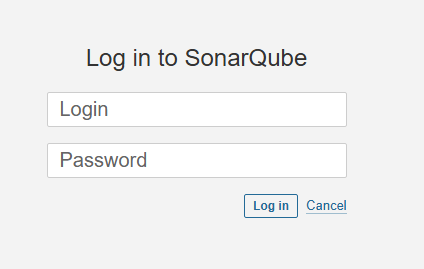
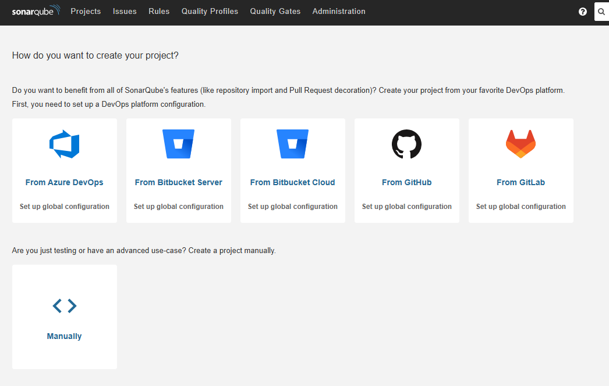
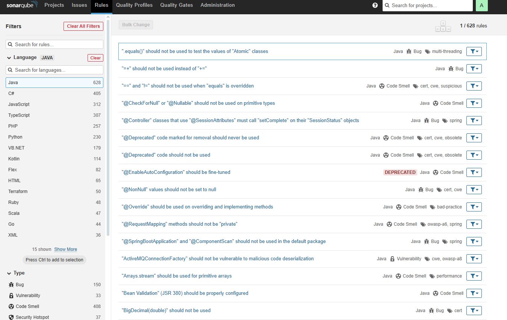

# 🚀 SonarQube con Docker

Guía paso a paso para instalar y ejecutar **SonarQube** usando **Docker**.  

---

## 📦 Requisitos previos
- Tener instalado **Docker Desktop (Community Edition)**.  
- Activar **Hyper-V** o la máquina virtual en tu sistema (según SO).  
- Tener una cuenta en [Docker Hub](https://hub.docker.com/) e iniciar sesión.  

---

## 🐳 1. Obtener la imagen oficial
Abre una terminal en Docker Desktop y ejecuta:
docker pull sonarqube:community
🔹 Para la versión Long Term Support (LTS):
```
docker pull sonarqube:lts-community
```
## 🛠 2. (Opcional) Crear una imagen personalizada
Si necesitas añadir plugins preinstalados u otras configuraciones:

## Clonar repositorio de Bitnami
git clone https://github.com/bitnami/containers.git

## Entrar al directorio de SonarQube
```
cd bitnami/sonarqube/VERSION/OPERATING-SYSTEM
```
## Construir la imagen personalizada
```
docker build -t mi-sonarqube:latest .
```
## ▶️ 3. Ejecutar SonarQube
Con la imagen lista (oficial o personalizada), levanta un contenedor:
```
docker run -d --name sonarqube -p 9000:9000 sonarqube:lts-community
```
## 🔍 Explicación rápida
```
-d → ejecuta en segundo plano (detached mode).

--name sonarqube → nombre del contenedor.

-p 9000:9000 → expone el puerto 9000.
```
## 🌐 4. Acceder a SonarQube
Abre tu navegador en:

👉 http://localhost:9000

Desde aquí podrás usar la interfaz gráfica y configurar tu instancia.

📋 Cheat Sheet (Resumen rápido)
## Descargar imagen
```
docker pull sonarqube:lts-community
```
## Ejecutar contenedor
```
docker run -d --name sonarqube -p 9000:9000 sonarqube:lts-community
```
## Acceder en navegador
http://localhost:9000

* Por defecto el user y pass es admin:admin; Debes modificarlo a un mejor pass. La seccion mas importante sera la pestaña de Rules que estaremos utilizando.



