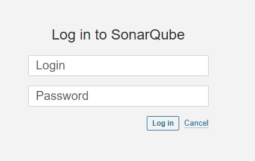
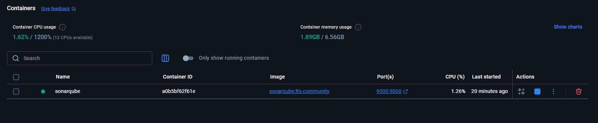
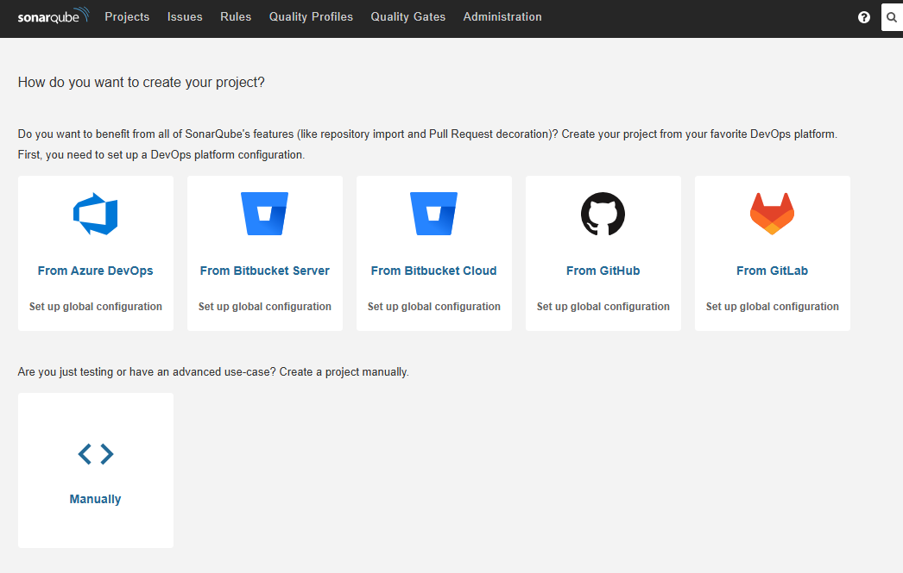
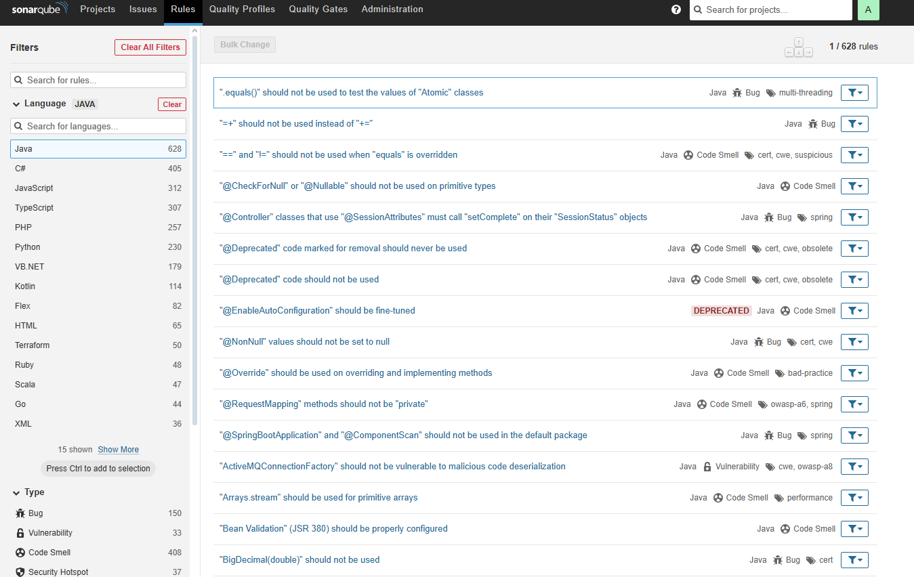

## 🇬🇧 Explanation in English

# 🚀 SonarQube with Docker

Step-by-step guide to install and run **SonarQube** using **Docker**.

---

## 📦 Prerequisites
- Have **Docker Desktop (Community Edition)** installed.
- Enable **Hyper-V** or the virtual machine in your system (according to OS).
- Have an account on [Docker Hub](https://hub.docker.com/) and log in.

---

## 🐳 1. Get the official image
Open a terminal in Docker Desktop and run:
docker pull sonarqube:community
🔹 For the Long Term Support (LTS) version:
```
docker pull sonarqube:lts-community
```

## 🛠 2. (Optional) Create a custom image
If you need to add pre-installed plugins or other configurations:

## Clone Bitnami repository
git clone https://github.com/bitnami/containers.git

## Enter the SonarQube directory
```
cd bitnami/sonarqube/VERSION/OPERATING-SYSTEM
```

## Build the custom image
```
docker build -t mi-sonarqube:latest .
```

## ▶️ 3. Run SonarQube
With the image ready (official or custom), start a container:
```
docker run -d --name sonarqube -p 9000:9000 sonarqube:lts-community
```

## 🔍 Quick explanation
```
-d → runs in background (detached mode).

--name sonarqube → container name.

-p 9000:9000 → exposes port 9000.
```

## 🌐 4. Access SonarQube
Open your browser at:
👉 http://localhost:9000

From here you can use the graphical interface and configure your instance.

📋 Cheat Sheet (Quick summary)
## Download image
```
docker pull sonarqube:lts-community
```

## Run container
```
docker run -d --name sonarqube -p 9000:9000 sonarqube:lts-community
```

## Access in browser
http://localhost:9000

* By default the user and password is admin:admin; You should change it to a better password. The most important section will be the Rules tab that we will be using.






# CI/CD Flow with Jenkins

This repository describes a typical **Continuous Integration (CI)** and **Continuous Deployment (CD)** flow using **Jenkins** as the orchestration tool.

The goal is to automate from code compilation to deployment and monitoring, reducing manual errors and accelerating software delivery.

---

## 📊 CI/CD Flow Diagram

flowchart LR
    A[📦 Source Code] --> B[🤖 CI - Continuous Integration<br/>(Build, Tests, Automation Tools)]
    B --> C[🚀 CD - Continuous Deployment<br/>(Deployment to environments)]
    C --> D[⚙️ Post-Deployment Management<br/>(Monitoring, Maintenance, Feedback)]

    %% Jenkins throughout the process
    B -.-> E[Jenkins - CI/CD Orchestrator]
    C -.-> E

---

## ⚙️ Explanation of each CI/CD flow stage

This flow ensures quality, automation, and fast deliveries through a controlled and scalable process.

---

## 📂 Source Code (Source Code)
- 📦 The repository contains the **application code**.
- 🔄 Use of **version control** with GitHub, GitLab, or Bitbucket.

---

## 🔄 Continuous Integration (CI)
- 🏗 **Code compilation**.
- ✅ Execution of **automated tests** (unit, integration, functional).
- 🔍 **Static quality analysis** with tools like **SonarQube**.
- 📑 **Report generation** to validate project status.

---

## 🚀 Continuous Deployment (CD)
- 🔄 **Automatic deployment** to **testing**, **staging**, or **production** environments.
- 🐳 Use of **containers (Docker/Kubernetes)** to ensure portability and scalability.

---

## 📡 Post-Deployment Management
- 📊 **Real-time application monitoring**.
- 📜 **Centralized logs** for efficient debugging.
- 🚨 **Automatically configured performance and error alerts**.
- 🔁 **Feedback** to the development team for continuous improvement.

---

## 🛠 Jenkins
- 🎯 Acts as the **central orchestrator**.
- 🤖 Automates execution of all stages: **build**, **tests**, **deployment**, and **monitoring**.
- 🔌 Compatible with multiple **plugins and external tools**.

```
pipeline {
    agent any

    stages {
        stage('Checkout Code') {
            steps {
                git branch: 'main', url: 'https://github.com/usuario/proyecto.git'
            }
        }

        stage('Build') {
            steps {
                echo 'Compiling application...'
                sh 'npm install'
                sh 'npm run build'
            }
        }

        stage('Test') {
            steps {
                echo 'Running tests...'
                sh 'npm test'
            }
            post {
                always {
                    junit 'reports/junit/*.xml'
                }
            }
        }

        stage('Quality Analysis') {
            steps {
                echo 'Running analysis with SonarQube...'
                sh 'sonar-scanner'
            }
        }

        stage('Deployment') {
            steps {
                echo 'Deploying application...'
                sh 'docker build -t mi-app .'
                sh 'docker run -d -p 8080:8080 mi-app'
            }
        }

        stage('Post-Deployment') {
            steps {
                echo 'Verifying application status...'
                sh 'curl -I http://localhost:8080'
            }
        }
    }

    post {
        success {
            echo '✅ Pipeline completed successfully.'
        }
        failure {
            echo '❌ Pipeline failed, check logs.'
        }
    }
}
```

# 🚀 Benefits of this CI/CD Flow

This workflow with Jenkins offers multiple advantages to the development and operations team:

- ✅ **Complete automation**: From compilation (build) to deployment (deploy).
- 🛡 **Fewer human errors**: Automatic validations on each commit.
- ⚡ **Fast deliveries**: Reduced development cycle and time-to-market.
- 📦 **Scalability**: Compatible with containers and cloud environments.

---

## 📖 Useful Resources

Here are some links to expand your knowledge:

- [📘 Official Jenkins Documentation](https://www.jenkins.io/doc/)
- [🔧 CI/CD Basic Concepts](https://www.redhat.com/es/topics/devops/what-is-ci-cd)
- [🐳 SonarQube in Docker](https://hub.docker.com/_/sonarqube)

---

---